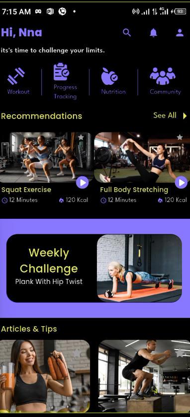
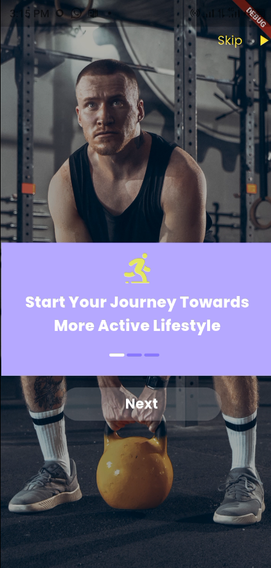
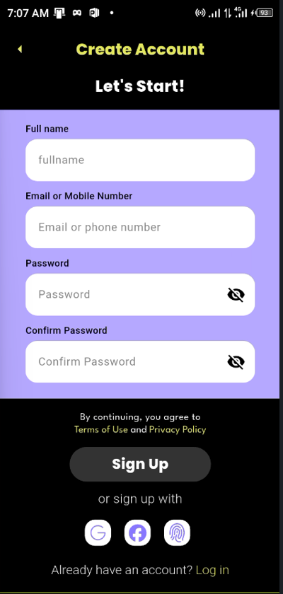
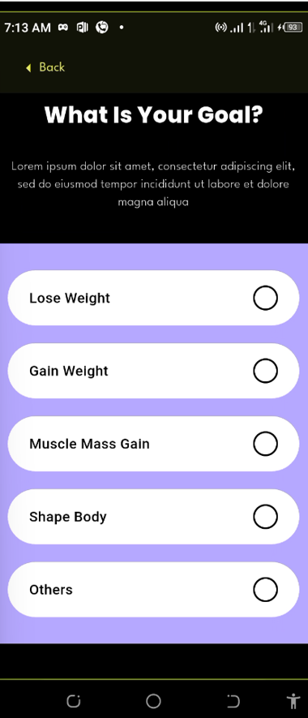

Fitness Builder 🏋️

A cross-platform fitness application built with Flutter and Dart, designed to provide users with a personalized fitness experience from onboarding and account creation through profile setup and the main fitness dashboard.

📱 Overview

Fitness Builder was developed from a detailed Figma UI design and implemented as a Flutter mobile application.

The project focuses on translating a visual design into a functional, responsive application while maintaining a structured architecture and separating authentication, user data, services, models, and application state.

The application uses Riverpod for state management.

✨ Features
User onboarding flow
User authentication
Account creation
User profile setup
Gender, age, weight, and height selection
Fitness goal selection
Physical activity level selection
Personalized user experience
Responsive Flutter UI
Reusable widgets and components
Riverpod state management
Structured models and services

🛠️ Tech Stack
Technology	Purpose
Flutter	Cross-platform application development
Dart	Programming language
Riverpod	State management
Figma	UI/UX design reference
Material Design	UI foundation

🏗️ Architecture

The application separates major responsibilities into different layers:

Models — Represent application and user data
Services — Handle application/business operations
State Management — Manages authentication and user state with Riverpod
Views — Application screens and UI
Reusable Widgets — Shared UI components

Authentication state and current-user/application data are handled separately to keep responsibilities clearly defined.

## 📸 Screenshots

### Home Dashboard

### User Onboarding

### Authentication

### Goal Selection

🚀 Getting Started
Prerequisites

Make sure you have Flutter installed and configured on your development machine.

Clone the repository
git clone https://github.com/Script023/fitness_builder.git
Navigate into the project
cd fitness_builder
Install dependencies
flutter pub get
Run the application
flutter run
📱 Platform

The application is currently developed and tested for Android using Flutter.

🎯 Project Purpose

This project was created to strengthen practical Flutter development skills by taking a complete UI design and turning it into a functional mobile application.

It also provided hands-on experience with:

State management
Application architecture
Authentication flows
User data management
Responsive UI development
Reusable Flutter components
Translating Figma designs into working interfaces

👨‍💻 Developer

Ikechukwu Nnamdi

Electrical Engineering graduate transitioning into software development, with a focus on Flutter and cross-platform mobile application development.

